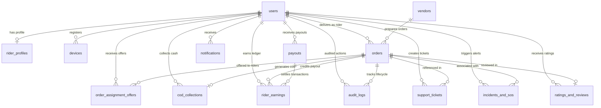

# Freska Delivery Partner Platform
# Module 02: Database Architecture & Relational Schema Specification

**Document ID**: `FRESKA-DOC-02`  
**Classification**: Engineering Specification  
**Engine**: MySQL 8.0+ / PostgreSQL 15+ (ACID Compliant, InnoDB Engine, utf8mb4_unicode_ci)  
**Version**: 1.0.0 (Production-Ready)  

---

## 1. Entity Relationship Diagram (Mermaid)

---

## 2. Exhaustive Table Specifications

### 2.1 Table: `users`
Represents core identity for riders, operations managers, dispatchers, and administrators.

| Column | Data Type | Nullable | Default | Description & Constraints |
| :--- | :--- | :--- | :--- | :--- |
| `id` | `BIGINT UNSIGNED` | No | Auto-Increment | Primary Key. |
| `name` | `VARCHAR(120)` | Yes | `NULL` | Full legal name of user. |
| `phone` | `VARCHAR(20)` | No | None | Unique phone number in E.164 format (`+919876543210`). |
| `phone_verified_at`| `TIMESTAMP` | Yes | `NULL` | Timestamp when OTP verification succeeded. |
| `email` | `VARCHAR(150)` | Yes | `NULL` | Unique email address (optional for riders). |
| `email_verified_at`| `TIMESTAMP` | Yes | `NULL` | Timestamp of email verification. |
| `password` | `VARCHAR(255)` | Yes | `NULL` | Bcrypt/Argon2id hash (used for admin/dispatcher panel). |
| `avatar_url` | `VARCHAR(500)` | Yes | `NULL` | Public S3 URL for profile picture. |
| `role` | `ENUM` | No | `'rider'` | `'rider'`, `'dispatcher'`, `'support_agent'`, `'operations_manager'`, `'super_admin'`. |
| `status` | `ENUM` | No | `'pending_kyc'` | `'active'`, `'suspended'`, `'inactive'`, `'pending_kyc'`. |
| `remember_token` | `VARCHAR(100)` | Yes | `NULL` | Session remember token. |
| `created_at` | `TIMESTAMP` | No | `CURRENT_TIMESTAMP`| Record creation timestamp. |
| `updated_at` | `TIMESTAMP` | No | `CURRENT_TIMESTAMP`| Record last update timestamp. |
| `deleted_at` | `TIMESTAMP` | Yes | `NULL` | Soft delete timestamp. |

* **Indexes**:
  * `UNIQUE KEY users_phone_unique (phone)`
  * `UNIQUE KEY users_email_unique (email)`
  * `INDEX idx_users_role_status (role, status)`
* **Foreign Keys**: None.
* **Relationships**:
  * Has One `RiderProfile` (`user_id`).
  * Has Many `Order` as rider (`rider_id`).
  * Has Many `Device` (`user_id`).
  * Has Many `RiderEarning` (`rider_id`).
  * Has Many `AuditLog` (`user_id`).

---

### 2.2 Table: `rider_profiles`
Maintains operational, KYC, bank account, and telemetry metadata for riders.

| Column | Data Type | Nullable | Default | Description & Constraints |
| :--- | :--- | :--- | :--- | :--- |
| `id` | `BIGINT UNSIGNED` | No | Auto-Increment | Primary Key. |
| `user_id` | `BIGINT UNSIGNED` | No | None | Foreign Key referencing `users(id)` ON DELETE CASCADE. |
| `date_of_birth` | `DATE` | Yes | `NULL` | Date of birth for age verification (Must be $\ge 18$). |
| `gender` | `ENUM` | Yes | `NULL` | `'male'`, `'female'`, `'other'`. |
| `blood_group` | `VARCHAR(10)` | Yes | `NULL` | Blood group for emergency SOS profile (e.g., `O+`, `B+`). |
| `vehicle_type` | `ENUM` | No | `'bike'` | `'bike'`, `'scooter'`, `'ev_two_wheeler'`, `'bicycle'`. |
| `vehicle_number` | `VARCHAR(30)` | Yes | `NULL` | Official vehicle registration number (e.g., `KA01AB1234`). |
| `license_number` | `VARCHAR(50)` | Yes | `NULL` | Driving license identifier. |
| `license_expiry` | `DATE` | Yes | `NULL` | Driving license expiry date. |
| `license_front_url`| `VARCHAR(500)` | Yes | `NULL` | S3 URL to front photo of driving license. |
| `license_back_url` | `VARCHAR(500)` | Yes | `NULL` | S3 URL to rear photo of driving license. |
| `rc_book_url` | `VARCHAR(500)` | Yes | `NULL` | S3 URL to vehicle registration card. |
| `id_proof_type` | `ENUM` | No | `'aadhaar'` | `'aadhaar'`, `'pan'`, `'passport'`, `'voter_id'`. |
| `id_proof_number` | `VARCHAR(50)` | Yes | `NULL` | Encrypted/hashed ID number. |
| `id_proof_url` | `VARCHAR(500)` | Yes | `NULL` | S3 URL to identity proof document. |
| `kyc_status` | `ENUM` | No | `'pending'` | `'pending'`, `'submitted'`, `'verified'`, `'rejected'`. |
| `kyc_rejection_reason`| `TEXT` | Yes | `NULL` | Feedback provided if KYC is rejected. |
| `kyc_reviewed_at`| `TIMESTAMP` | Yes | `NULL` | Timestamp of approval/rejection. |
| `kyc_reviewed_by`| `BIGINT UNSIGNED` | Yes | `NULL` | FK referencing `users(id)` of reviewer. |
| `bank_account_holder`| `VARCHAR(150)`| Yes | `NULL` | Legal name as registered with bank. |
| `bank_name` | `VARCHAR(100)` | Yes | `NULL` | Financial institution name (e.g. HDFC Bank). |
| `bank_account_number`| `VARCHAR(50)`| Yes | `NULL` | Encrypted bank account number. |
| `bank_ifsc_code` | `VARCHAR(20)` | Yes | `NULL` | Bank branch IFSC code. |
| `bank_upi_id` | `VARCHAR(100)` | Yes | `NULL` | Virtual Payment Address for instant transfers. |
| `bank_verified` | `BOOLEAN` | No | `FALSE` | Confirmation of penny-drop / automated IFSC check. |
| `emergency_contact_name`| `VARCHAR(120)`| Yes | `NULL`| Next-of-kin emergency contact name. |
| `emergency_contact_phone`| `VARCHAR(20)`| Yes | `NULL`| Next-of-kin phone number. |
| `emergency_contact_relation`| `VARCHAR(50)`| Yes | `NULL`| Relationship (e.g., `'Father'`, `'Spouse'`). |
| `is_online` | `BOOLEAN` | No | `FALSE` | Rider duty availability flag. |
| `current_latitude`| `DECIMAL(10,8)`| Yes | `NULL` | Last known GPS latitude (WGS 84). |
| `current_longitude`| `DECIMAL(11,8)`| Yes | `NULL` | Last known GPS longitude (WGS 84). |
| `last_location_updated_at`| `TIMESTAMP`| Yes | `NULL` | Telemetry heartbeat timestamp. |
| `max_cash_limit` | `DECIMAL(10,2)`| No | `5000.00` | Max COD cash in hand before account lockout. |
| `current_cash_in_hand`| `DECIMAL(10,2)`| No | `0.00` | Current un-remitted COD balance held. |
| `rating_average` | `DECIMAL(3,2)` | No | `5.00` | Running rating average (1.00 - 5.00). |
| `rating_count` | `INT UNSIGNED` | No | `0` | Total ratings received from customers. |
| `acceptance_rate`| `DECIMAL(5,2)` | No | `100.00` | Order offer acceptance percentage (0 - 100.00). |
| `on_time_rate` | `DECIMAL(5,2)` | No | `100.00` | On-time delivery SLA performance percentage. |
| `completed_deliveries_count`| `INT UNSIGNED`| No | `0`| Lifetime successful deliveries. |
| `tier` | `ENUM` | No | `'bronze'` | `'bronze'`, `'silver'`, `'gold'`, `'platinum'`. |
| `insurance_policy_number`| `VARCHAR(100)`| Yes | `NULL`| Freska group accidental insurance ID. |
| `insurance_provider`| `VARCHAR(150)`| Yes | `NULL`| Underwriter company name. |
| `insurance_valid_until`| `DATE` | Yes | `NULL` | Expiration date of policy coverage. |
| `insurance_document_url`| `VARCHAR(500)`| Yes | `NULL`| S3 link to insurance card document. |
| `created_at` | `TIMESTAMP` | No | `CURRENT_TIMESTAMP`| Created timestamp. |
| `updated_at` | `TIMESTAMP` | No | `CURRENT_TIMESTAMP`| Updated timestamp. |

* **Indexes**:
  * `UNIQUE KEY rider_profiles_user_id_unique (user_id)`
  * `INDEX idx_riders_online_location (is_online, current_latitude, current_longitude)`
  * `INDEX idx_riders_kyc_status (kyc_status)`
  * `INDEX idx_riders_cash_limit (current_cash_in_hand, max_cash_limit)`
* **Foreign Keys**:
  * `FOREIGN KEY (user_id) REFERENCES users(id) ON DELETE CASCADE`
  * `FOREIGN KEY (kyc_reviewed_by) REFERENCES users(id) ON DELETE SET NULL`
* **Relationships**:
  * Belongs To `User` (`user_id`).

---

### 2.3 Table: `vendors`
Stores merchant partner information where riders pick up fresh groceries.

| Column | Data Type | Nullable | Default | Description & Constraints |
| :--- | :--- | :--- | :--- | :--- |
| `id` | `BIGINT UNSIGNED` | No | Auto-Increment | Primary Key. |
| `name` | `VARCHAR(150)` | No | None | Store or fulfillment hub brand name. |
| `store_code` | `VARCHAR(50)` | No | None | Unique alphanumeric store code (e.g. `HUB-BLR-04`). |
| `phone` | `VARCHAR(20)` | No | None | Contact number for pickup desk. |
| `email` | `VARCHAR(150)` | Yes | `NULL` | Vendor operations email. |
| `address` | `TEXT` | No | None | Full physical street address. |
| `landmark` | `VARCHAR(150)` | Yes | `NULL` | Prominent navigation landmark. |
| `latitude` | `DECIMAL(10,8)`| No | None | Store latitude. |
| `longitude` | `DECIMAL(11,8)`| No | None | Store longitude. |
| `pickup_instructions`| `TEXT` | Yes | `NULL` | Instructions for riders (e.g. "Enter via Gate 2"). |
| `contact_person` | `VARCHAR(100)` | Yes | `NULL` | Store manager / dispatch lead name. |
| `is_active` | `BOOLEAN` | No | `TRUE` | Vendor active status. |
| `created_at` | `TIMESTAMP` | No | `CURRENT_TIMESTAMP`| Created timestamp. |
| `updated_at` | `TIMESTAMP` | No | `CURRENT_TIMESTAMP`| Updated timestamp. |

* **Indexes**:
  * `UNIQUE KEY vendors_store_code_unique (store_code)`
  * `INDEX idx_vendors_geo (latitude, longitude)`
* **Foreign Keys**: None.
* **Relationships**:
  * Has Many `Order` (`vendor_id`).

---

### 2.4 Table: `orders`
Core order model handling lifecycle state transitions, payouts, customer addresses, and POD.

| Column | Data Type | Nullable | Default | Description & Constraints |
| :--- | :--- | :--- | :--- | :--- |
| `id` | `BIGINT UNSIGNED` | No | Auto-Increment | Primary Key. |
| `order_number` | `VARCHAR(50)` | No | None | Unique tracking reference (e.g. `FSK-2026-89421`). |
| `vendor_id` | `BIGINT UNSIGNED` | No | None | FK referencing `vendors(id)`. |
| `rider_id` | `BIGINT UNSIGNED` | Yes | `NULL` | FK referencing `users(id)` (Rider assigned). |
| `customer_name` | `VARCHAR(120)` | No | None | Recipient customer name. |
| `customer_phone` | `VARCHAR(20)` | No | None | Customer phone (Masked in API responses). |
| `delivery_address`| `TEXT` | No | None | Full street address with flat/door number. |
| `delivery_area` | `VARCHAR(150)` | No | None | General sub-locality (Exposed to rider before acceptance). |
| `delivery_latitude`| `DECIMAL(10,8)`| No | None | Destination GPS latitude. |
| `delivery_longitude`| `DECIMAL(11,8)`| No | None | Destination GPS longitude. |
| `delivery_instructions`| `TEXT` | Yes | `NULL` | Drop-off notes ("Leave with guard", "Ring bell"). |
| `order_type` | `ENUM` | No | `'grocery'` | `'fresh_produce'`, `'dairy_cold_chain'`, `'grocery'`, `'bakery'`, `'express'`. |
| `item_count` | `INT UNSIGNED` | No | `1` | Total quantity of items in package. |
| `package_details`| `JSON` | Yes | `NULL` | Item names, quantities, weight, and shelf tags. |
| `is_fragile` | `BOOLEAN` | No | `FALSE` | Fragile package handling warning. |
| `is_cold_chain` | `BOOLEAN` | No | `FALSE` | Temperature-sensitive item requiring insulated bag. |
| `status` | `ENUM` | No | `'created'` | `'created'`, `'dispatched'`, `'offered'`, `'accepted'`, `'arrived_vendor'`, `'picked_up'`, `'in_transit'`, `'arrived_customer'`, `'delivered'`, `'cancelled'`, `'rejected'`, `'failed'`. |
| `payment_mode` | `ENUM` | No | `'prepaid'` | `'prepaid'`, `'cod'`. |
| `cod_amount` | `DECIMAL(10,2)`| No | `0.00` | Cash amount to be collected if payment is COD. |
| `is_cod_collected`| `BOOLEAN` | No | `FALSE` | Status of cash handover from customer. |
| `cod_collected_at`| `TIMESTAMP` | Yes | `NULL` | Timestamp when cash was marked received. |
| `delivery_otp` | `VARCHAR(6)` | Yes | `NULL` | 4 or 6 digit verification OTP shared with customer. |
| `delivery_signature_url`| `VARCHAR(500)`| Yes | `NULL`| S3 link to digital signature canvas PNG. |
| `delivery_proof_photo_url`| `VARCHAR(500)`| Yes | `NULL`| S3 link to door-drop proof-of-delivery photo. |
| `estimated_distance_km`| `DECIMAL(6,2)`| No | None | Total route distance (Vendor $\rightarrow$ Customer). |
| `estimated_duration_mins`| `INT UNSIGNED`| No | None | Estimated transit time in minutes. |
| `base_payout` | `DECIMAL(8,2)` | No | None | Guaranteed base delivery fee. |
| `distance_payout`| `DECIMAL(8,2)` | No | `0.00` | Per-kilometer distance compensation. |
| `surge_payout` | `DECIMAL(8,2)` | No | `0.00` | High demand / adverse weather surge allowance. |
| `tip_amount` | `DECIMAL(8,2)` | No | `0.00` | Direct customer tip (100% credited to rider). |
| `total_rider_payout`| `DECIMAL(8,2)`| No | None | Net earnings credited upon successful delivery. |
| `assignment_offered_at`| `TIMESTAMP`| Yes | `NULL` | Offer broadcast timestamp. |
| `assignment_accepted_at`| `TIMESTAMP`| Yes | `NULL` | Acceptance timestamp. |
| `arrived_vendor_at`| `TIMESTAMP`| Yes | `NULL` | Geofence timestamp at store. |
| `picked_up_at` | `TIMESTAMP` | Yes | `NULL` | Order pickup confirmation timestamp. |
| `delivered_at` | `TIMESTAMP` | Yes | `NULL` | Delivery completion timestamp. |
| `cancelled_at` | `TIMESTAMP` | Yes | `NULL` | Cancellation timestamp. |
| `cancellation_reason`| `TEXT` | Yes | `NULL` | Reason for order failure or cancellation. |
| `created_at` | `TIMESTAMP` | No | `CURRENT_TIMESTAMP`| Created timestamp. |
| `updated_at` | `TIMESTAMP` | No | `CURRENT_TIMESTAMP`| Updated timestamp. |

* **Indexes**:
  * `UNIQUE KEY orders_order_number_unique (order_number)`
  * `INDEX idx_orders_status (status)`
  * `INDEX idx_orders_rider_status (rider_id, status)`
  * `INDEX idx_orders_vendor (vendor_id)`
  * `INDEX idx_orders_created (created_at)`
* **Foreign Keys**:
  * `FOREIGN KEY (vendor_id) REFERENCES vendors(id) ON DELETE RESTRICT`
  * `FOREIGN KEY (rider_id) REFERENCES users(id) ON DELETE SET NULL`
* **Relationships**:
  * Belongs To `Vendor` (`vendor_id`).
  * Belongs To `User` (`rider_id`).
  * Has Many `OrderAssignmentOffer` (`order_id`).
  * Has One `CodCollection` (`order_id`).
  * Has Many `RiderEarning` (`order_id`).
  * Has Many `AuditLog` (`order_id`).

---

### 2.5 Table: `order_assignment_offers`
Tracks order broadcast offers dispatched to riders, managing the 30-second countdown lifecycle.

| Column | Data Type | Nullable | Default | Description & Constraints |
| :--- | :--- | :--- | :--- | :--- |
| `id` | `BIGINT UNSIGNED` | No | Auto-Increment | Primary Key. |
| `order_id` | `BIGINT UNSIGNED` | No | None | FK referencing `orders(id)`. |
| `rider_id` | `BIGINT UNSIGNED` | No | None | FK referencing `users(id)`. |
| `offered_at` | `TIMESTAMP` | No | `CURRENT_TIMESTAMP`| Timestamp offer was pushed. |
| `expires_at` | `TIMESTAMP` | No | None | Precise timestamp when offer auto-expires (30s window). |
| `status` | `ENUM` | No | `'offered'` | `'offered'`, `'accepted'`, `'rejected'`, `'expired'`. |
| `rejection_reason`| `VARCHAR(255)`| Yes | `NULL` | Reason code if rejected by rider. |
| `response_timestamp`| `TIMESTAMP`| Yes | `NULL` | Timestamp rider interacted with modal. |

* **Indexes**:
  * `INDEX idx_offers_order_rider (order_id, rider_id, status)`
  * `INDEX idx_offers_expiry (status, expires_at)`
* **Foreign Keys**:
  * `FOREIGN KEY (order_id) REFERENCES orders(id) ON DELETE CASCADE`
  * `FOREIGN KEY (rider_id) REFERENCES users(id) ON DELETE CASCADE`

---

### 2.6 Table: `cod_collections`
Tracks cash collected by riders on COD orders and their remittance to Freska.

| Column | Data Type | Nullable | Default | Description & Constraints |
| :--- | :--- | :--- | :--- | :--- |
| `id` | `BIGINT UNSIGNED` | No | Auto-Increment | Primary Key. |
| `order_id` | `BIGINT UNSIGNED` | No | None | FK referencing `orders(id)` (One COD entry per order). |
| `rider_id` | `BIGINT UNSIGNED` | No | None | FK referencing `users(id)` (Rider holding cash). |
| `amount` | `DECIMAL(10,2)`| No | None | Exact cash currency collected. |
| `collected_at` | `TIMESTAMP` | No | `CURRENT_TIMESTAMP`| Timestamp cash was received from customer. |
| `collection_latitude`| `DECIMAL(10,8)`| Yes | `NULL`| Location of physical cash handover. |
| `collection_longitude`|`DECIMAL(11,8)`| Yes | `NULL`| Location of physical cash handover. |
| `handover_status`| `ENUM` | No | `'held_in_hand'`| `'held_in_hand'`, `'submitted'`, `'verified_reconciled'`, `'disputed'`. |
| `handover_method`| `ENUM` | Yes | `NULL` | `'hub_deposit'`, `'bank_cdm'`, `'upi_clawback'`. |
| `handover_reference`|`VARCHAR(100)`| Yes | `NULL` | Bank deposit slip number or UPI transaction UTR. |
| `handover_receipt_url`|`VARCHAR(500)`| Yes | `NULL` | S3 URL to photo of cash deposit receipt. |
| `submitted_at` | `TIMESTAMP` | Yes | `NULL` | Timestamp rider initiated remittance. |
| `reconciled_at` | `TIMESTAMP` | Yes | `NULL` | Timestamp operations reconciled deposit. |
| `reconciled_by` | `BIGINT UNSIGNED` | Yes | `NULL` | FK referencing `users(id)` of finance manager. |
| `reconciliation_notes`|`TEXT` | Yes | `NULL` | Administrative audit notes. |
| `created_at` | `TIMESTAMP` | No | `CURRENT_TIMESTAMP`| Created timestamp. |
| `updated_at` | `TIMESTAMP` | No | `CURRENT_TIMESTAMP`| Updated timestamp. |

* **Indexes**:
  * `UNIQUE KEY cod_order_id_unique (order_id)`
  * `INDEX idx_cod_rider_status (rider_id, handover_status)`
* **Foreign Keys**:
  * `FOREIGN KEY (order_id) REFERENCES orders(id) ON DELETE RESTRICT`
  * `FOREIGN KEY (rider_id) REFERENCES users(id) ON DELETE RESTRICT`
  * `FOREIGN KEY (reconciled_by) REFERENCES users(id) ON DELETE SET NULL`

---

### 2.7 Table: `rider_earnings`
Immutable financial ledger recording individual credit transactions.

| Column | Data Type | Nullable | Default | Description & Constraints |
| :--- | :--- | :--- | :--- | :--- |
| `id` | `BIGINT UNSIGNED` | No | Auto-Increment | Primary Key. |
| `rider_id` | `BIGINT UNSIGNED` | No | None | FK referencing `users(id)`. |
| `order_id` | `BIGINT UNSIGNED` | Yes | `NULL` | FK referencing `orders(id)` (NULL for shift incentives). |
| `earning_type` | `ENUM` | No | None | `'delivery_fee'`, `'distance_bonus'`, `'surge_bonus'`, `'customer_tip'`, `'daily_incentive'`, `'weekly_milestone'`, `'deduction'`. |
| `amount` | `DECIMAL(8,2)` | No | None | Signed transaction amount (Positive credit, negative deduction). |
| `description` | `VARCHAR(255)` | No | None | Human-readable statement line. |
| `date` | `DATE` | No | None | Calendar date of earning event. |
| `payout_id` | `BIGINT UNSIGNED` | Yes | `NULL` | FK referencing `payouts(id)` when settled. |
| `status` | `ENUM` | No | `'pending'` | `'pending'`, `'processed'`, `'paid'`. |
| `created_at` | `TIMESTAMP` | No | `CURRENT_TIMESTAMP`| Created timestamp. |
| `updated_at` | `TIMESTAMP` | No | `CURRENT_TIMESTAMP`| Updated timestamp. |

* **Indexes**:
  * `INDEX idx_earnings_rider_date (rider_id, date)`
  * `INDEX idx_earnings_payout (payout_id)`
  * `INDEX idx_earnings_status (status)`
* **Foreign Keys**:
  * `FOREIGN KEY (rider_id) REFERENCES users(id) ON DELETE CASCADE`
  * `FOREIGN KEY (order_id) REFERENCES orders(id) ON DELETE SET NULL`
  * `FOREIGN KEY (payout_id) REFERENCES payouts(id) ON DELETE SET NULL`

---

### 2.8 Table: `payouts`
Periodic batch disbursement records processed to rider bank accounts.

| Column | Data Type | Nullable | Default | Description & Constraints |
| :--- | :--- | :--- | :--- | :--- |
| `id` | `BIGINT UNSIGNED` | No | Auto-Increment | Primary Key. |
| `payout_number` | `VARCHAR(50)` | No | None | Unique statement reference (e.g. `PO-2026-W38-0041`). |
| `rider_id` | `BIGINT UNSIGNED` | No | None | FK referencing `users(id)`. |
| `period_start` | `DATE` | No | None | Cycle start date. |
| `period_end` | `DATE` | No | None | Cycle end date. |
| `deliveries_count`| `INT UNSIGNED`| No | None | Total orders delivered in cycle. |
| `base_amount` | `DECIMAL(10,2)`| No | None | Cumulative base delivery payout. |
| `incentives_amount`|`DECIMAL(10,2)`| No | `0.00` | Surge and bonus earnings. |
| `tips_amount` | `DECIMAL(10,2)`| No | `0.00` | 100% customer tip pool. |
| `deductions_amount`|`DECIMAL(10,2)`| No | `0.00` | Adjustments, bag deposits, or penalties. |
| `net_payout_amount`|`DECIMAL(10,2)`| No | None | Final net settlement disbursed. |
| `bank_reference_number`|`VARCHAR(100)`| Yes | `NULL`| IMPS / NEFT / UPI transaction reference UTR. |
| `payment_method`| `ENUM` | No | `'bank_transfer'`| `'bank_transfer'`, `'upi_payout'`, `'instant_transfer'`. |
| `status` | `ENUM` | No | `'pending'` | `'pending'`, `'processing'`, `'completed'`, `'failed'`. |
| `processed_at` | `TIMESTAMP` | Yes | `NULL` | Timestamp bank transaction cleared. |
| `failure_reason`| `TEXT` | Yes | `NULL` | Error details returned if bank rejected transfer. |
| `created_at` | `TIMESTAMP` | No | `CURRENT_TIMESTAMP`| Created timestamp. |
| `updated_at` | `TIMESTAMP` | No | `CURRENT_TIMESTAMP`| Updated timestamp. |

* **Indexes**:
  * `UNIQUE KEY payouts_payout_number_unique (payout_number)`
  * `INDEX idx_payouts_rider_status (rider_id, status)`
* **Foreign Keys**:
  * `FOREIGN KEY (rider_id) REFERENCES users(id) ON DELETE CASCADE`

---

### 2.9 Table: `support_tickets`
In-app help and grievance tickets logged by riders.

| Column | Data Type | Nullable | Default | Description & Constraints |
| :--- | :--- | :--- | :--- | :--- |
| `id` | `BIGINT UNSIGNED` | No | Auto-Increment | Primary Key. |
| `ticket_number` | `VARCHAR(50)` | No | None | Alphanumeric tracking ID (e.g. `TCK-2026-1049`). |
| `rider_id` | `BIGINT UNSIGNED` | No | None | FK referencing `users(id)`. |
| `order_id` | `BIGINT UNSIGNED` | Yes | `NULL` | FK referencing `orders(id)` if order-specific. |
| `category` | `ENUM` | No | None | `'customer_issue'`, `'vendor_pickup_issue'`, `'payment_payout_issue'`, `'emergency_support'`, `'app_technical_issue'`, `'other'`. |
| `subject` | `VARCHAR(200)` | No | None | Short title of grievance. |
| `description` | `TEXT` | No | None | Detailed message. |
| `attachment_url`| `VARCHAR(500)` | Yes | `NULL` | S3 URL to screenshot or photo evidence. |
| `priority` | `ENUM` | No | `'medium'` | `'low'`, `'medium'`, `'high'`, `'critical'`. |
| `status` | `ENUM` | No | `'open'` | `'open'`, `'in_progress'`, `'resolved'`, `'closed'`. |
| `assigned_to` | `BIGINT UNSIGNED` | Yes | `NULL` | FK referencing `users(id)` (Support agent). |
| `resolution_notes`| `TEXT` | Yes | `NULL` | Agent explanation upon closing ticket. |
| `resolved_at` | `TIMESTAMP` | Yes | `NULL` | Timestamp resolved. |
| `created_at` | `TIMESTAMP` | No | `CURRENT_TIMESTAMP`| Created timestamp. |
| `updated_at` | `TIMESTAMP` | No | `CURRENT_TIMESTAMP`| Updated timestamp. |

* **Indexes**:
  * `UNIQUE KEY tickets_number_unique (ticket_number)`
  * `INDEX idx_tickets_rider (rider_id, status)`
  * `INDEX idx_tickets_priority_status (status, priority)`
* **Foreign Keys**:
  * `FOREIGN KEY (rider_id) REFERENCES users(id) ON DELETE CASCADE`
  * `FOREIGN KEY (order_id) REFERENCES orders(id) ON DELETE SET NULL`
  * `FOREIGN KEY (assigned_to) REFERENCES users(id) ON DELETE SET NULL`

---

### 2.10 Table: `incidents_and_sos`
Critical emergency events, road accidents, and panic button triggers.

| Column | Data Type | Nullable | Default | Description & Constraints |
| :--- | :--- | :--- | :--- | :--- |
| `id` | `BIGINT UNSIGNED` | No | Auto-Increment | Primary Key. |
| `incident_number`| `VARCHAR(50)` | No | None | Unique incident code (e.g. `SOS-2026-0048`). |
| `rider_id` | `BIGINT UNSIGNED` | No | None | FK referencing `users(id)`. |
| `order_id` | `BIGINT UNSIGNED` | Yes | `NULL` | FK referencing active `orders(id)`. |
| `type` | `ENUM` | No | None | `'sos_panic'`, `'road_accident'`, `'vehicle_breakdown'`, `'customer_harassment'`, `'dog_bite'`, `'weather_hazard'`. |
| `latitude` | `DECIMAL(10,8)`| No | None | Exact incident GPS latitude. |
| `longitude` | `DECIMAL(11,8)`| No | None | Exact incident GPS longitude. |
| `location_address`| `TEXT` | Yes | `NULL` | Reverse-geocoded physical landmark. |
| `description` | `TEXT` | Yes | `NULL` | Rider notes or witness details. |
| `media_urls` | `JSON` | Yes | `NULL` | S3 links to accident site photos or vehicle damage. |
| `medical_assistance_needed`|`BOOLEAN`| No | `FALSE`| Emergency ambulance dispatch flag. |
| `status` | `ENUM` | No | `'triggered'` | `'triggered'`, `'acknowledged'`, `'ops_dispatched'`, `'resolved'`, `'false_alarm'`. |
| `acknowledged_at`| `TIMESTAMP` | Yes | `NULL` | Timestamp operations control picked up event. |
| `acknowledged_by`| `BIGINT UNSIGNED`| Yes | `NULL` | FK referencing `users(id)`. |
| `resolution_report`|`TEXT` | Yes | `NULL` | Post-incident operations investigation report. |
| `created_at` | `TIMESTAMP` | No | `CURRENT_TIMESTAMP`| Created timestamp. |
| `updated_at` | `TIMESTAMP` | No | `CURRENT_TIMESTAMP`| Updated timestamp. |

* **Indexes**:
  * `UNIQUE KEY incidents_number_unique (incident_number)`
  * `INDEX idx_incidents_type_status (type, status)`
  * `INDEX idx_incidents_rider (rider_id)`
* **Foreign Keys**:
  * `FOREIGN KEY (rider_id) REFERENCES users(id) ON DELETE CASCADE`
  * `FOREIGN KEY (order_id) REFERENCES orders(id) ON DELETE SET NULL`
  * `FOREIGN KEY (acknowledged_by) REFERENCES users(id) ON DELETE SET NULL`

---

### 2.11 Table: `audit_logs`
Immutable compliance and security ledger recording all lifecycle mutations.

| Column | Data Type | Nullable | Default | Description & Constraints |
| :--- | :--- | :--- | :--- | :--- |
| `id` | `BIGINT UNSIGNED` | No | Auto-Increment | Primary Key. |
| `user_id` | `BIGINT UNSIGNED` | Yes | `NULL` | FK referencing `users(id)` (Actor). |
| `order_id` | `BIGINT UNSIGNED` | Yes | `NULL` | FK referencing `orders(id)` (Subject). |
| `action` | `VARCHAR(100)` | No | None | Code (e.g. `'ORDER_ACCEPTED'`, `'ORDER_PICKED_UP'`, `'COD_COLLECTED'`). |
| `latitude` | `DECIMAL(10,8)`| Yes | `NULL` | GPS latitude of client at event time. |
| `longitude` | `DECIMAL(11,8)`| Yes | `NULL` | GPS longitude of client at event time. |
| `ip_address` | `VARCHAR(45)` | Yes | `NULL` | Client IPv4 or IPv6 address. |
| `user_agent` | `VARCHAR(255)` | Yes | `NULL` | Device OS and browser/app user-agent header. |
| `metadata` | `JSON` | Yes | `NULL` | Arbitrary audit payload (diffs, previous states). |
| `created_at` | `TIMESTAMP` | No | `CURRENT_TIMESTAMP`| Immutable creation timestamp (No updates allowed). |

* **Indexes**:
  * `INDEX idx_audit_order (order_id)`
  * `INDEX idx_audit_user (user_id)`
  * `INDEX idx_audit_action (action)`
  * `INDEX idx_audit_created (created_at)`
* **Foreign Keys**:
  * `FOREIGN KEY (user_id) REFERENCES users(id) ON DELETE SET NULL`
  * `FOREIGN KEY (order_id) REFERENCES orders(id) ON DELETE SET NULL`

---

### 2.12 Table: `notifications`
Persistent notification inbox records.

| Column | Data Type | Nullable | Default | Description & Constraints |
| :--- | :--- | :--- | :--- | :--- |
| `id` | `BIGINT UNSIGNED` | No | Auto-Increment | Primary Key. |
| `user_id` | `BIGINT UNSIGNED` | No | None | FK referencing `users(id)`. |
| `title` | `VARCHAR(150)` | No | None | Notification title. |
| `body` | `TEXT` | No | None | Message body text. |
| `type` | `ENUM` | No | None | `'order_assignment'`, `'pickup_reminder'`, `'delivery_update'`, `'payout_credited'`, `'announcement'`, `'security_alert'`. |
| `data` | `JSON` | Yes | `NULL` | Routing metadata (e.g. `{"order_id": 1042}`). |
| `is_read` | `BOOLEAN` | No | `FALSE` | Read state flag. |
| `read_at` | `TIMESTAMP` | Yes | `NULL` | Timestamp read. |
| `created_at` | `TIMESTAMP` | No | `CURRENT_TIMESTAMP`| Created timestamp. |

* **Indexes**:
  * `INDEX idx_notifications_user_read (user_id, is_read)`
* **Foreign Keys**:
  * `FOREIGN KEY (user_id) REFERENCES users(id) ON DELETE CASCADE`

---

### 2.13 Table: `devices`
Tracks rider hardware devices for single-active-session security and FCM tokens.

| Column | Data Type | Nullable | Default | Description & Constraints |
| :--- | :--- | :--- | :--- | :--- |
| `id` | `BIGINT UNSIGNED` | No | Auto-Increment | Primary Key. |
| `user_id` | `BIGINT UNSIGNED` | No | None | FK referencing `users(id)`. |
| `device_id` | `VARCHAR(150)` | No | None | Unique hardware UUID generated on client. |
| `fcm_token` | `VARCHAR(500)` | Yes | `NULL` | Firebase Cloud Messaging push registration token. |
| `device_model` | `VARCHAR(100)` | Yes | `NULL` | Hardware name (e.g., `'Pixel 8 Pro'`). |
| `os_version` | `VARCHAR(50)` | Yes | `NULL` | OS version (e.g., `'Android 14'`). |
| `app_version` | `VARCHAR(30)` | Yes | `NULL` | Freska app build string (e.g., `'1.0.4+12'`). |
| `is_active` | `BOOLEAN` | No | `TRUE` | Active status (Set to false on logout/kick). |
| `last_active_at`| `TIMESTAMP` | Yes | `NULL` | Heartbeat timestamp. |
| `created_at` | `TIMESTAMP` | No | `CURRENT_TIMESTAMP`| Created timestamp. |
| `updated_at` | `TIMESTAMP` | No | `CURRENT_TIMESTAMP`| Updated timestamp. |

* **Indexes**:
  * `UNIQUE KEY devices_device_id_unique (device_id)`
  * `INDEX idx_devices_user_active (user_id, is_active)`
* **Foreign Keys**:
  * `FOREIGN KEY (user_id) REFERENCES users(id) ON DELETE CASCADE`

---

### 2.14 Table: `ratings_and_reviews`
Customer ratings and compliments collected upon delivery completion.

| Column | Data Type | Nullable | Default | Description & Constraints |
| :--- | :--- | :--- | :--- | :--- |
| `id` | `BIGINT UNSIGNED` | No | Auto-Increment | Primary Key. |
| `order_id` | `BIGINT UNSIGNED` | No | None | FK referencing `orders(id)`. |
| `rider_id` | `BIGINT UNSIGNED` | No | None | FK referencing `users(id)`. |
| `rating` | `TINYINT UNSIGNED`| No | None | Star rating score (1 to 5). |
| `badges` | `JSON` | Yes | `NULL` | Compliments (e.g., `["fast_delivery", "friendly", "polite"]`). |
| `feedback_comment`|`TEXT` | Yes | `NULL` | Qualitative customer feedback. |
| `created_at` | `TIMESTAMP` | No | `CURRENT_TIMESTAMP`| Created timestamp. |

* **Indexes**:
  * `UNIQUE KEY ratings_order_id_unique (order_id)`
  * `INDEX idx_ratings_rider (rider_id)`
* **Foreign Keys**:
  * `FOREIGN KEY (order_id) REFERENCES orders(id) ON DELETE CASCADE`
  * `FOREIGN KEY (rider_id) REFERENCES users(id) ON DELETE CASCADE`
