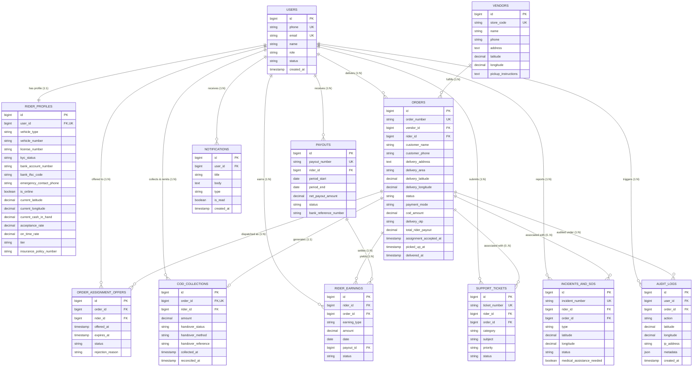

# Freska Delivery Partner Platform — Entity Relationship (ER) Diagram

This document models the core domain entities, relational integrity constraints, and cardinality rules for the Freska Delivery Partner Platform.

---

## 1. Visual Entity-Relationship Diagram

---

## 2. Relational Cardinality & Referential Integrity

1. **User to Rider Profile (`1:1`)**:
   - `rider_profiles.user_id` is unique and references `users.id` with `ON DELETE CASCADE`.
2. **Vendor to Orders (`1:N`)**:
   - `orders.vendor_id` references `vendors.id` with `ON DELETE RESTRICT`. A vendor cannot be deleted if active or historical orders exist.
3. **Rider to Orders (`1:N`)**:
   - `orders.rider_id` references `users.id` with `ON DELETE SET NULL`.
4. **Order to COD Collection (`1:1`)**:
   - `cod_collections.order_id` is unique and references `orders.id` with `ON DELETE RESTRICT`.
5. **Payout to Rider Earnings (`1:N`)**:
   - `rider_earnings.payout_id` references `payouts.id` with `ON DELETE SET NULL`. Individual line items remain immutable even if a payout record is modified.
6. **Audit Trail Immutability**:
   - `audit_logs` has no update or cascade delete triggers; append-only schema for SOC2 and regulatory compliance.
